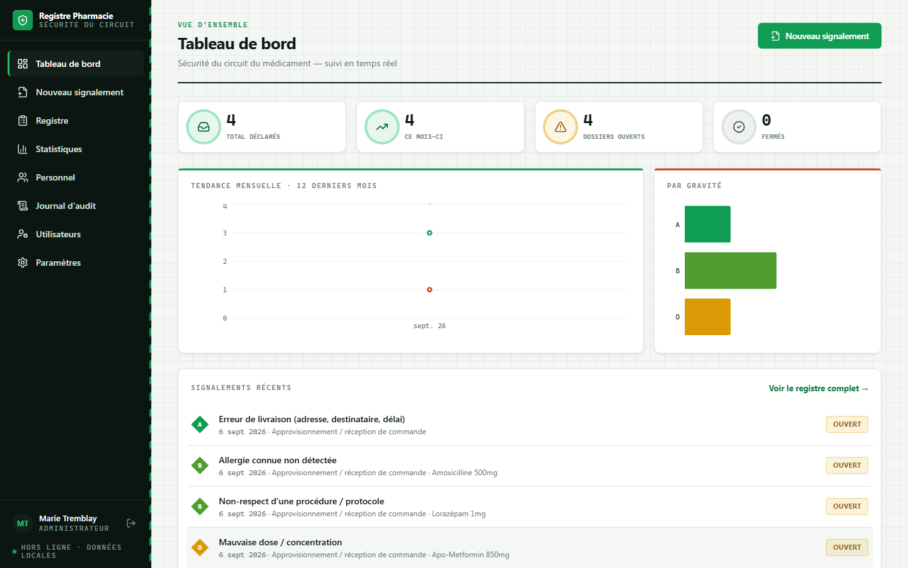
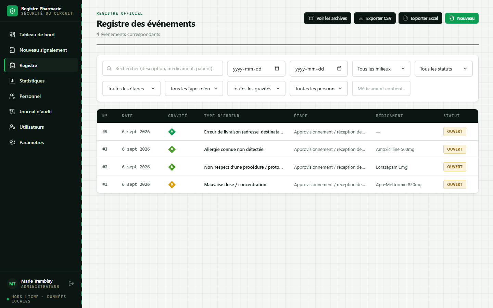
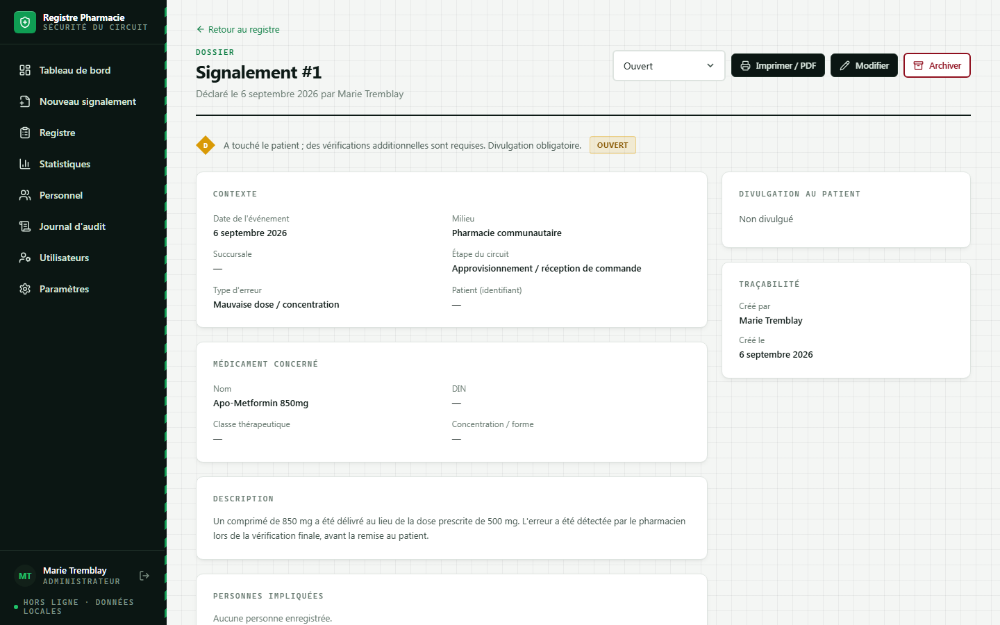
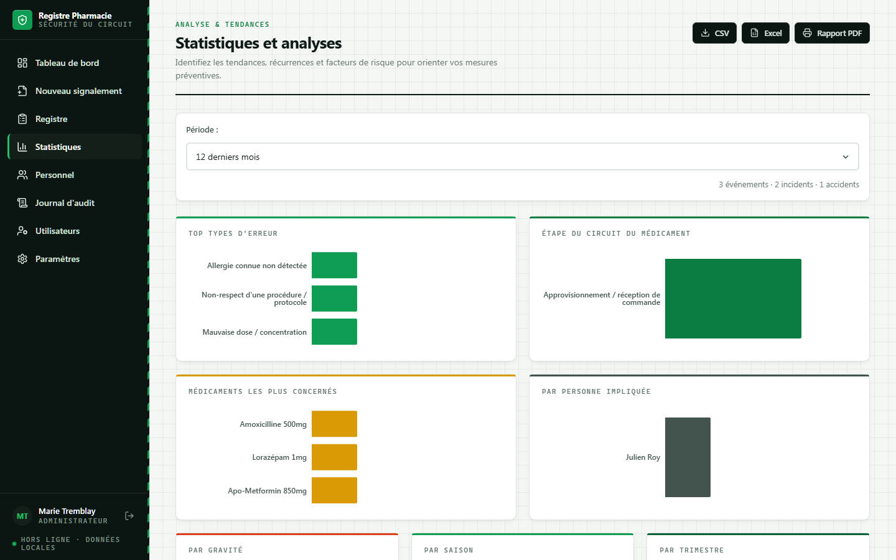

# Registre des Incidents Pharmacie

Application de bureau **100 % hors ligne** pour déclarer, suivre et analyser les incidents et accidents liés au circuit du médicament — pensée pour la pharmacienne-chef, le pharmacien-chef ou le pharmacien propriétaire qui administre le registre au quotidien, en pharmacie communautaire, en préparation, en pharmacie spécialisée ou en établissement.

Basée sur les standards de référence de l'OPQ et du MSSS (échelle de gravité NCC MERP / formulaire AH-223-1).



## Fonctionnalités

- **Registre complet** des signalements — recherche, filtres, exports CSV/Excel, import CSV pour numériser un historique papier
- **Comptes utilisateurs et rôles** (Administrateur / Utilisateur), mots de passe chiffrés, aucune donnée transmise sur Internet
- **Journal d'audit infalsifiable** — chaque création, modification, archivage ou restauration est horodaté et attribué
- **Archivage** plutôt que suppression — aucun signalement ne disparaît jamais du registre
- **Signatures électroniques** — les personnes impliquées confirment la prise de connaissance d'un signalement directement à l'écran, horodaté
- **Suivi des mesures correctives** — transformez le plan d'action en tâches concrètes avec responsable et échéance
- **Déclaration FARPOPQ assistée** — résumé généré automatiquement, validé par le pharmacien, puis transmis vous-même via l'espace membre du Fonds d'assurance (l'application ne transmet jamais rien elle-même)
- **Feuille de signatures imprimable** pour un cartable papier
- **Statistiques et récurrences** — tendances mensuelles, par gravité, par saison, détection automatique de récurrences (médicament, type d'erreur, personne)
- **Recherche de médicament assistée** — plus de 10 000 produits issus de la base de données officielle de Santé Canada, avec remplissage automatique du DIN, de la concentration et de la classe thérapeutique
- **Sauvegardes automatiques** rotatives, en plus de la sauvegarde/restauration manuelle
- **Palette de commandes (Ctrl+K)** pour naviguer rapidement

| Registre | Fiche d'un signalement | Statistiques |
|---|---|---|
|  |  |  |

## Installation

Téléchargez la dernière version pour votre système sur la page **[Releases](../../releases/latest)** :

- **Windows** — `Registre des Incidents Pharmacie Setup X.X.X.exe`, puis suivez l'assistant d'installation.
- **macOS** — `Registre des Incidents Pharmacie-X.X.X.dmg`, puis glissez l'application dans le dossier Applications.

> **Première ouverture sur macOS** : l'application n'étant pas signée par un compte développeur Apple payant, macOS affichera un avertissement (« application endommagée » ou « développeur non identifié »). Faites un **clic droit sur l'application → Ouvrir**, puis confirmez — cette étape n'est nécessaire qu'une seule fois. Vous pouvez aussi ouvrir **Réglages Système → Confidentialité et sécurité** et cliquer sur « Ouvrir quand même ».

Aucune connexion Internet n'est requise pour l'installation ni pour l'utilisation. Toutes les données restent sur l'ordinateur où l'application est installée.

## Guide d'utilisation

Un guide complet (index, captures d'écran, navigation, FAQ) est disponible dans [`docs/guide-utilisateur.html`](docs/guide-utilisateur.html) — ouvrez-le simplement dans un navigateur. Une version imprimable est aussi fournie : [`docs/Guide-utilisateur-Registre-Incidents.pdf`](docs/Guide-utilisateur-Registre-Incidents.pdf).

## Confidentialité et données

- Toutes les données (signalements, personnel, comptes, journal d'audit) sont stockées dans un seul fichier local, sur l'ordinateur où l'application est installée.
- Aucune donnée n'est envoyée sur Internet, aucun compte en ligne n'est requis.
- La liste de médicaments intégrée provient de l'extrait public du [Fichier des produits pharmaceutiques de Santé Canada](https://www.canada.ca/fr/sante-canada/services/medicaments-produits-sante/medicaments/base-donnees-produits-pharmaceutiques.html) (données ouvertes du gouvernement du Canada) — c'est une liste figée intégrée à l'application, pas une connexion en direct.

## Développement

Prérequis : [Node.js](https://nodejs.org/) 20 ou plus récent.

```bash
npm install
npm run dev          # lance l'application en mode développement (navigateur, sans Electron)
npm start             # lance l'application complète dans Electron
npm run dist          # construit l'installateur pour la plateforme courante
```

Les installateurs Windows et macOS sont construits automatiquement par [GitHub Actions](.github/workflows/build.yml) et publiés sur la page Releases à chaque étiquette de version (`vX.X.X`) — un Mac réel n'est pas nécessaire pour produire l'installateur macOS.

### Mettre à jour la liste des médicaments

La liste de médicaments (marque, dose, classe, DIN) est régénérée à partir de l'extrait officiel de Santé Canada :

```bash
node scripts/build-medicaments-dpd.mjs
```

(nécessite d'avoir téléchargé au préalable `drug.zip`, `ingred.zip`, `form.zip` et `ther.zip` depuis la [page d'extraction de données](https://www.canada.ca/en/health-canada/services/drugs-health-products/drug-products/drug-product-database/what-data-extract-drug-product-database.html) dans `scripts/dpd-src/`).

## Pile technique

Electron · React 18 · TypeScript · Vite · Tailwind CSS · Recharts · sql.js (SQLite compilé en WebAssembly)

## Licence

Tous droits réservés. Ce dépôt est public à des fins de consultation et de distribution des installateurs ; aucune licence d'utilisation, de modification ou de redistribution du code n'est accordée sans autorisation explicite.
